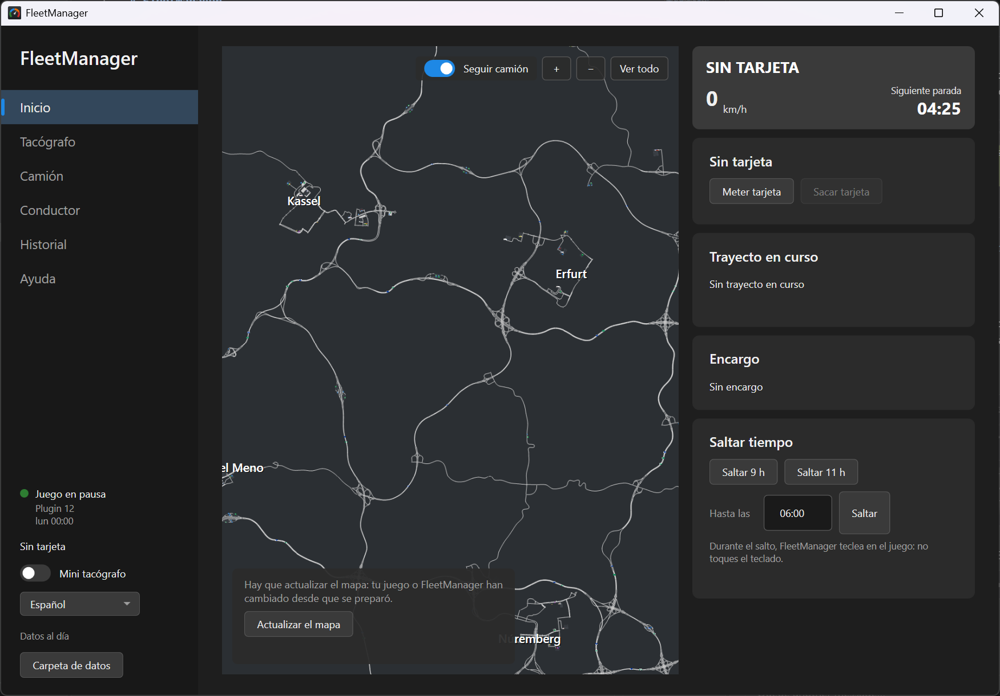
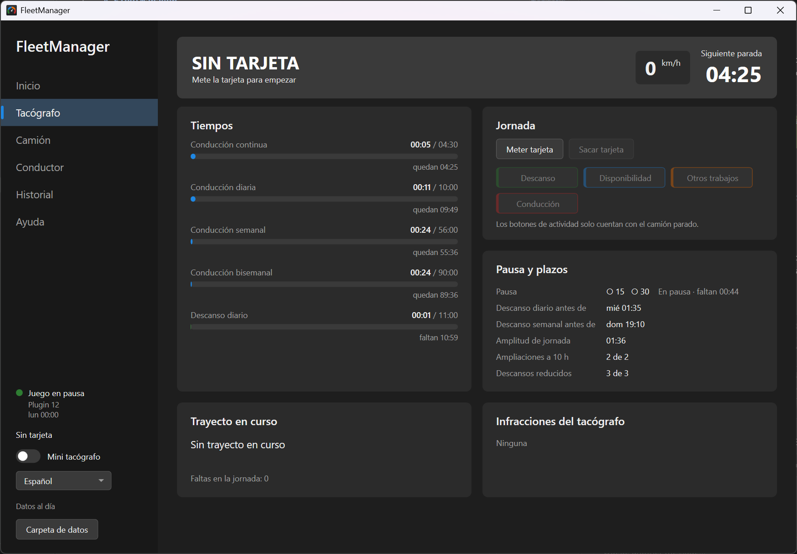

# FleetManager

Tacógrafo digital y gestor de jornadas para **Euro Truck Simulator 2**. Lee el juego en
tiempo real y lleva tus tiempos de conducción y descanso con las reglas de la UE
(Reglamento CE 561/2006), para que planifiques tus viajes como un camionero de verdad.

🌍 Disponible en **español, English, Deutsch, Français, Italiano, Português, Polski,
Nederlands y Türkçe** (se elige solo según el idioma de Windows y se cambia en el menú).

## Qué hace

- **Como un tacógrafo de verdad:** metes la tarjeta al empezar y la sacas al terminar.
- **Tacógrafo automático:** conducción, otros trabajos, disponibilidad y descanso
  según lo que haces en el juego (en marcha, parado con el motor encendido, motor apagado).
- **Reglas de la UE:** conducción continua (4 h 30), diaria (9 h / 10 h), semanal (56 h)
  y bisemanal (90 h); pausas de 45 min o 15 + 30; descansos diarios (normal, dividido y
  reducido) y semanales; plazos y avisos antes de cada parada obligatoria.
- **Mapa del juego interactivo** con el recorrido de cada jornada y la posición del camión.
- **Historial** de jornadas y trayectos (origen, destino, carga, km, velocidades, faltas),
  editable, con su recorrido en el mapa y exportación a CSV.
- **Mini tacógrafo** siempre visible encima del juego.
- **Saltar tiempo** (9 h, 11 h o hasta una hora) para hacer los descansos sin esperar.
- Faltas de velocidad y de conducción, datos del camión y del conductor, y una sección
  de **Ayuda** que explica cómo planificarse.

## Instalación

1. Descarga `FleetManager-Instalador-<versión>.exe` de la página de
   [versiones (Releases)](../../releases/latest).
2. Ábrelo. Windows puede mostrar **"Windows protegió tu PC"** porque el instalador no
   está firmado: pulsa **Más información → Ejecutar de todas formas**.
3. Se instala solo para tu usuario (no pide permiso de administrador) y crea un acceso
   directo en el escritorio. No hace falta instalar nada más.
4. Abre FleetManager. Si el juego no tiene el plugin de telemetría, verás el botón
   **Instalar plugin** en el menú de la izquierda (Windows pedirá permiso de administrador
   para copiarlo a la carpeta del juego). Después abre el juego y acepta el aviso de
   "funciones avanzadas del SDK".
5. En **Inicio**, pulsa **Preparar el mapa** (unos 4 minutos) para ver el mapa de tu juego.

### Antes de jugar

En el juego, en **Opciones → Juego**, desactiva:

- **Rest state simulation** (simulación del estado de descanso)
- **Mandatory break simulation** (simulación de pausas obligatorias)

Así los descansos los marcas tú siguiendo el tacógrafo, y no el juego.

## Requisitos

- Windows 10 u 11 de 64 bits.
- Euro Truck Simulator 2 (versión de Steam, probado con la 1.61).

Tus datos se guardan en `%LOCALAPPDATA%\FleetManager` y no se borran al desinstalar.

## Créditos

- [ts-map](https://github.com/dariowouters/ts-map), de dariowouters (MIT): lectura del
  mapa del juego.
- [scs-sdk-plugin](https://github.com/RenCloud/scs-sdk-plugin), de RenCloud (MIT):
  plugin de telemetría y librería para leerla.

Euro Truck Simulator 2 es una marca de SCS Software. FleetManager es un proyecto de un
aficionado, sin relación con SCS Software.

## Licencia

© 2026 IamMaxiii. **Todos los derechos reservados.** Puedes usar FleetManager gratis; el
código se publica solo para consulta y no se puede copiar, modificar ni redistribuir sin
permiso. Detalles en [LICENSE](LICENSE).

## English

FleetManager is a digital tachograph and shift manager for **Euro Truck Simulator 2**.
It reads the game in real time and tracks your driving and rest times with the EU rules
(Regulation EC 561/2006): insert the card when you start, remove it when you finish, and
plan your stops like a real truck driver. It includes the game map with the route of each
shift, a trip history with CSV export, an always-on-top mini tachograph and a time skip
for rests. The app is available in 9 languages.

Download the installer from [Releases](../../releases/latest), open it (if Windows shows
"Windows protected your PC", click **More info → Run anyway**) and, in the game, turn off
**Rest state simulation** and **Mandatory break simulation** (Options → Gameplay).
